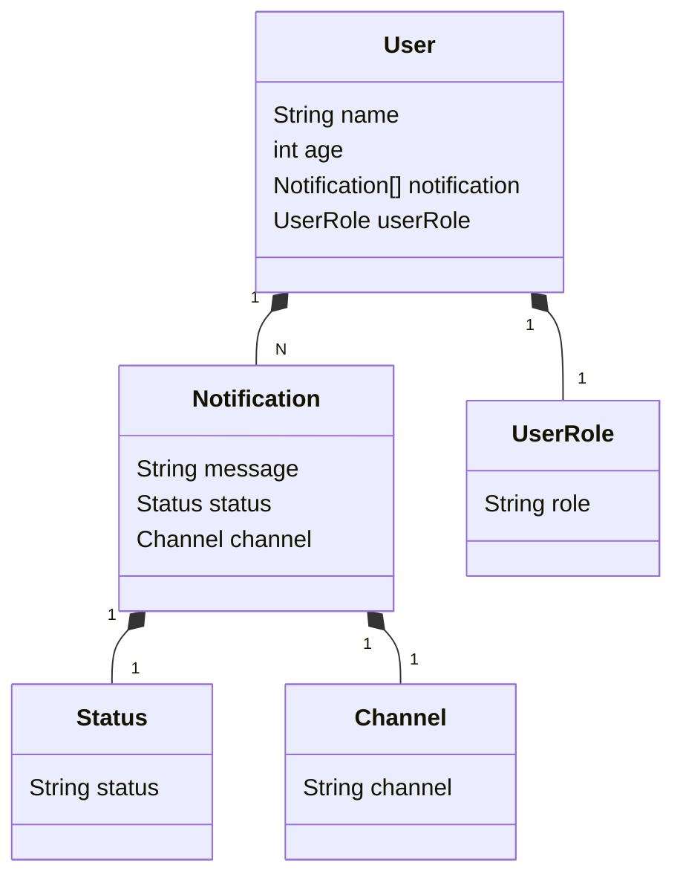

```mermaid
classDiagram
    class User {
        String name
        int age
        Notification[] notification
        UserRole userRole
    }

    class Notification {
        String message
        Status status
        Channel channel
    }

    class Status {
	    String status
    }

    class Channel{
      String channel
    }

    class UserRole {
        String role
    }

    User"1" *-- "N"Notification 
    User"1" *-- "1"UserRole
    Notification"1" *-- "1"Status
    Notification"1" *-- "1"Channel
```
