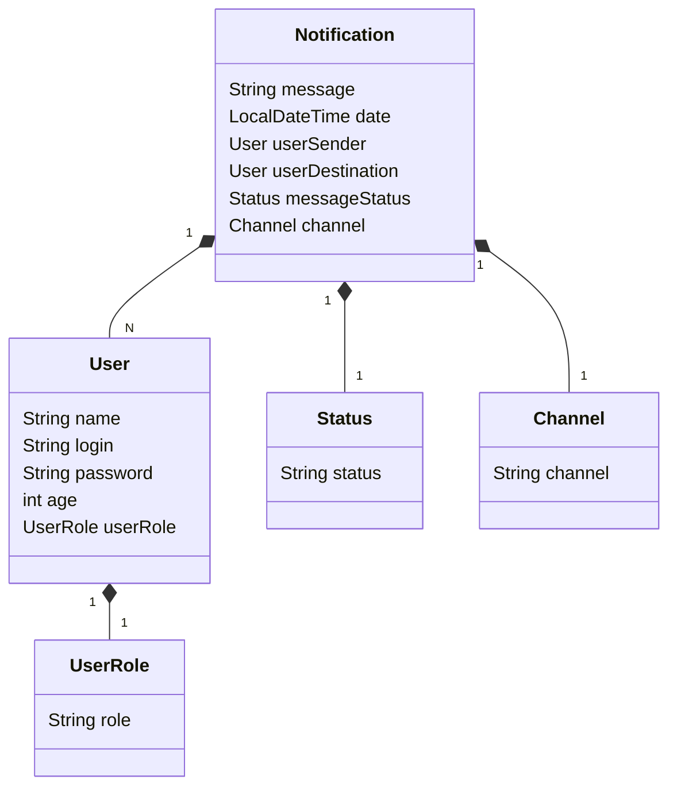

```mermaid
classDiagram
    class User {
	String name
        String login
	String password
        int age
        UserRole userRole
    }

    class Notification {
        String message
	LocalDateTime date
	User userSender
	User userDestination
        Status messageStatus
        Channel channel
    }

    class Status {
	    String status
    }

    class Channel{
      String channel
    }

    class UserRole {
        String role
    }

    User"1" *-- "1"UserRole
    Notification"1" *-- "1"Status
    Notification"1" *-- "1"Channel
    Notification "1" *-- "N" User
```
